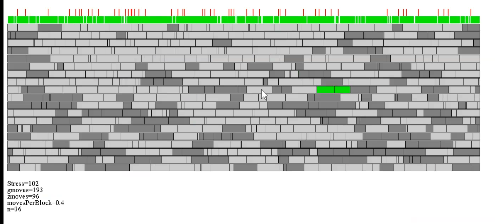

# Bricklayers Challenge
The provided program solves the bricklayers-challenge from the [2018 German Computer Science Competition BWINF](https://bwinf.de/fileadmin/wettbewerbe/bundeswettbewerb/36/2_runde/aufgaben362.pdf) (page 4: "Aufgabe 1: Die Kunst der Fuge"). 
The original problem statement stems from Barry Cipra.

This Java implementation here can find solutions up to ca. n=2000 in some minutes, at which point RAM becomes a limiting factor. At the time of the contest n=34 was the largest known solution.

Screenshot of the simulated annealing solving process for n=36. Red bars indicate remaining collisions. The two green blocks just swapped their position to reduce collisions.

# Run:
Have some Java Environment (for example [BlueJ](https://www.bluej.org/)) ready and open ``/Mauerproblem_GlobalRepair`` as a project. Then create an instance of Starter(), this runs the program.

There are three principal user-parameters that can be set, all in the "Main" class at the top:

- ``n=36``, the desired wall size,

- ``liveGraphics = [true | false] ``, live animation of the solving process (best seen for n=20..30 range)

- ``wtime = 500``, the wait-time in milliseconds for the liveGraphics to render the next step. Reduce for faster animations.

With the current defaults (liveGraphics=false and n=36) you should receive a result almost immediately. The found wall solution is written in ``/saved`` and some logs in ``/logs``.

With liveGraphics=true, it depends a bit on your system whether the animation is shown correctly. Originally the code was running on Windows, so best results might be obtained in that environment. 
Or luck with the Java/Graphics interplay. Also multiple starts of the program can help.

# Solving idea
The overall solving idea is to initialize the wall with some fully randomized blocks (length 1...n per layer) and then do a local gradient descend on the block positions. 
I.e. it repeatedly swap blocks within one layer to greedily reduce the number of collisions between layers. Swaps are done in two ways. 
Either pairwise swaps between to adjacent blocks. Or triplet swap, where two adjacent small blocks (a,b) and a third long block c with matching length c=a+b swap
their position.  Swapping is done greedily, so this program can run into local minima occasionally. For that case some restarting is done if it doesnt detect any progress for too long.
This happens sometimes, especially for larger instances, but often it also directly finds a solution at the first attempt, especially for smaller instances.

# Video 
A video of the solving process is provided at ``graphics_n=36.mp4``, direct link .
